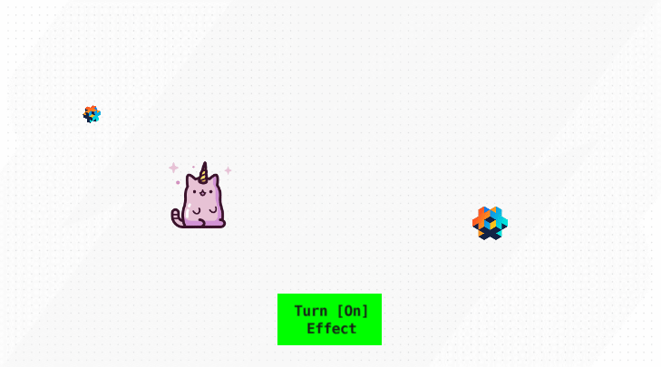

# Defold Spotlight Projector Effect

## Join The Room 606!
> 
>
> 🦄 Come join our friendly 🇷🇺 ru-speaking community in `Telegram`: [@TheRoom606](https://t.me/TheRoom606)
> 
> A chat: https://t.me/TheRoom606Chat

## Description:
This `Defold` game project represents nice and commonly used visual effect of hightliting zones of interest for the players - widely used in casual, hybrid casual mobile games when onboarding the player in first tutorial steps.

✅ Compatible with Defold `1.10.4`

🎮 **[Play Demo Here](https://zugzug90.github.io/web-mobile-gestures-starter/)**

Thanks to the Telegram buddy @brace_r for the fragment and vertex shader programs as a starter points.

## How to use
TBD

For now please look into `projector_spotlight_controller.script` as a basic usage case.

## Project Dependencies and Prerequisits
1. Project uses [Druid](https://github.com/Insality/druid) and [Defold Event](https://github.com/Insality/defold-event). But just for demo purposes. The one can use any other custom solution for managing UI controls.

## What's implemented:
1. Hide/Show Fade Screen
1. Configurable amount (up to 20) and radius of the projector spots 
3. Programmatic control of the amount, color and radius of the projector spots

## Out of scope:
1. Tint of the fade. Current is bluish. Can be changed currently in the fragment shader - `projector_spotlight_2d_shader`.
1. Light diffusion behaviors - currently hardcoded as is. No sets of behavior - just one variant currently.

### Credits: Used free icons from: 

<a href="https://www.flaticon.com/free-icons/cute" title="cute icons">Cute icons created by Freepik - Flaticon</a>
